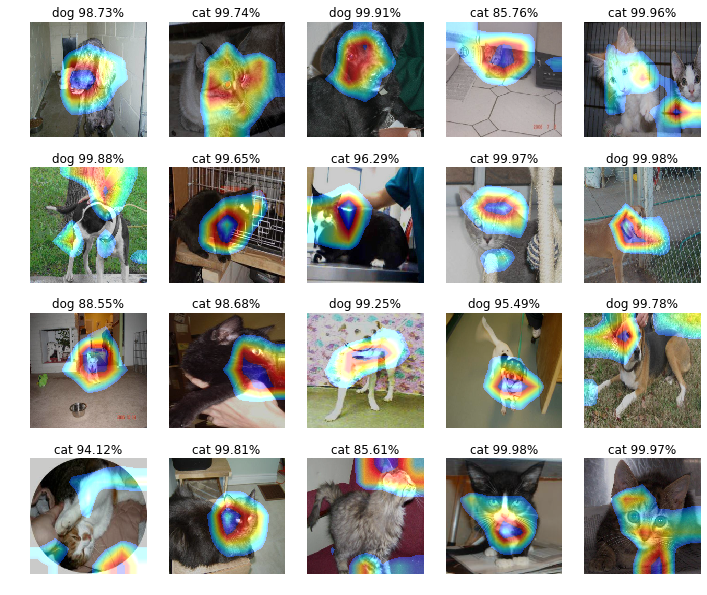

## Capstone project
### ResNet-50 for Cats.Vs.Dogs.

### Necessary Libraries
- keras
- NumPy
- OpenCV
- tensorflow
- matplotlib
- tqdm

### Dataset
Initial dataset is downloaded from [kaggle](https://www.kaggle.com/c/dogs-vs-cats-redux-kernels-edition/data). The dataset includes two folders *test* and *train*.

But I split *train* folder manual into 2 folders:

- trian ---- including two folders
	- cat ---- including 12000 cat images
	- dog ---- including 12000 dog images
- valid ---- including two folders 
 	- cat ---- including 500 cat images
	- dog ---- including 500 dog images


The changed dataset can download from the [link](https://my.pcloud.com/publink/show?code=XZHx8PZkM8tUtIwjw0GQYpwAuu38FPeMEly) I shared from pCloud.

#### preview dataset


### Training Time

- 24s per epoch (2048 images)
- total epochs: 20
- CPU i7 6700K
- GPU GTX 980 Ti
- Memory 32GB


### Result preview

#### Result


#### feature heatmap



### Reference

```
@article{He2015,
    author = {Kaiming He and Xiangyu Zhang and Shaoqing Ren and Jian Sun},
    title = {Deep Residual Learning for Image Recognition},
    journal = {arXiv preprint arXiv:1512.03385},
    year = {2015}
}

@article{zhou2015cnnlocalization,
    title={{Learning Deep Features for Discriminative Localization.}},
    author={Zhou, B. and Khosla, A. and Lapedriza. A. and Oliva, A. and Torralba, A.},
    journal={CVPR},
    year={2016}
}
```
