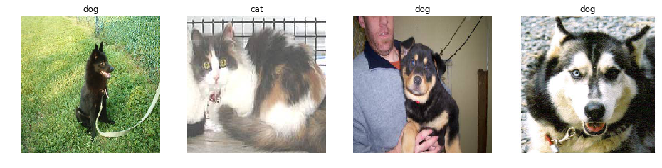
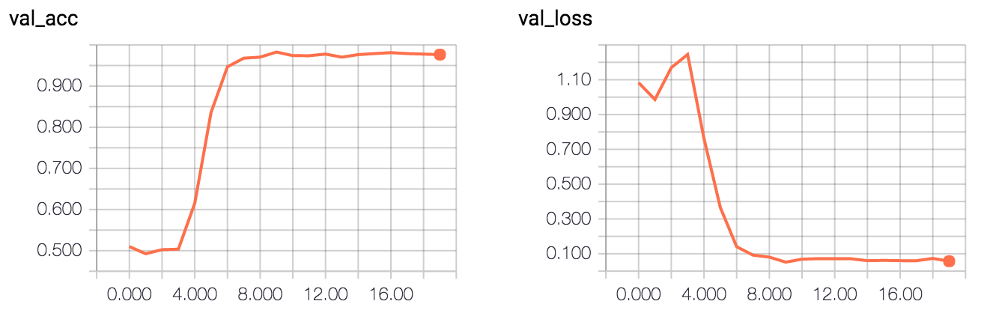
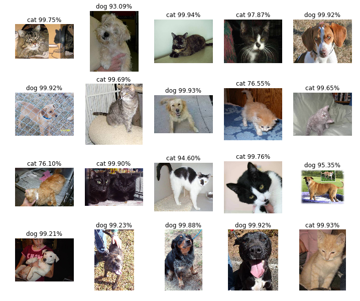
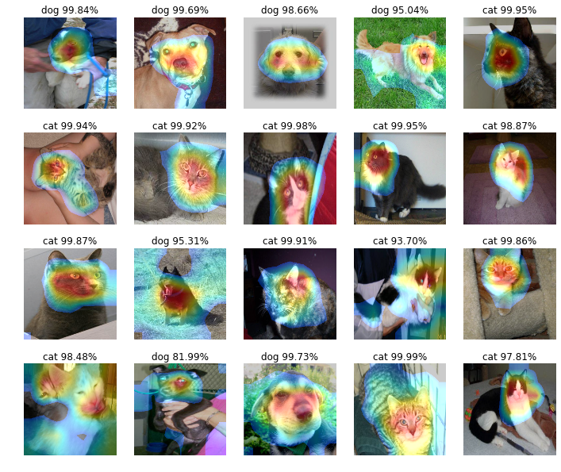

## Capstone project
### ResNet-50 for Cats.Vs.Dogs.

### Environment

Python 2.7.12
Mac OS X 10.11.6
CUDA 8.0.47
cuDNN 5.1

### Necessary Libraries

- keras 1.1.2
- NumPy 1.11.2
- OpenCV 3.1.0
- tensorflow gpu 0.11.0
- matplotlib 1.5.1
- tqdm 4.7.6
- sklearn 0.18.1
- seaborn 0.7.1
- pandas 0.19.1

### Dataset

Initial dataset is downloaded from [kaggle](https://www.kaggle.com/c/dogs-vs-cats-redux-kernels-edition/data). The dataset includes two folders *test* and *train*.

But I split *train* folder into 2 folders:

the prossessing steps completed in *preprocessing train dataset.ipynb*  

- mytrain ---- including two folders
	- cat ---- including about 11250 cat images
	- dog ---- including about 11250 dog images
- myvalid ---- including two folders 
 	- cat ---- including about 1250 cat images
	- dog ---- including about 1250 dog images


#### Dataset preview



### Training Time

- 24s per epoch (2048 images)
- total epochs: 20
- CPU i7 6700K
- GPU GTX 980 Ti
- Memory 32GB



### Result preview

#### Result



#### Feature heatmap



### Reference

```
@article{He2015,
    author = {Kaiming He and Xiangyu Zhang and Shaoqing Ren and Jian Sun},
    title = {Deep Residual Learning for Image Recognition},
    journal = {arXiv preprint arXiv:1512.03385},
    year = {2015}
}

@article{zhou2015cnnlocalization,
    author={Zhou, B. and Khosla, A. and Lapedriza. A. and Oliva, A. and Torralba, A.},
    title={{Learning Deep Features for Discriminative Localization.}},
    journal={CVPR},
    year={2016}
}
```
